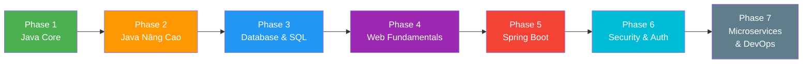

# 🚀 Lộ Trình Tự Học Java Core → Java Backend

> **Mục tiêu**: Từ zero trở thành Java Backend Developer có khả năng xây dựng REST API, làm việc với database, bảo mật ứng dụng, và triển khai hệ thống microservices.
>
> **Tổng thời gian dự kiến**: **6 – 8 tháng** (học 3-4 giờ/ngày)
>
> **Ngày bắt đầu**: 09/04/2026

---

## 📋 Tổng Quan Lộ Trình



| Phase | Chủ đề | Thời gian | Mức độ |
|:-----:|--------|:---------:|:------:|
| 1 | Java Core Cơ Bản | 4-5 tuần | 🟢 Beginner |
| 2 | Java Core Nâng Cao | 3-4 tuần | 🟡 Intermediate |
| 3 | Database & SQL | 2-3 tuần | 🟡 Intermediate |
| 4 | Web Fundamentals | 2 tuần | 🟡 Intermediate |
| 5 | Spring Framework & Spring Boot | 5-6 tuần | 🔴 Advanced |
| 6 | Security, Auth & Testing | 3 tuần | 🔴 Advanced |
| 7 | Microservices & DevOps | 4-5 tuần | 🔴 Advanced |

---

## Phase 1: Java Core Cơ Bản ☕

> **Thời gian**: 4-5 tuần · **Mục tiêu**: Nắm vững nền tảng ngôn ngữ Java

### 📅 Tuần 1-2: Nền Tảng Lập Trình Java

#### Kiến thức cần học
- [ ] **Cài đặt môi trường**: JDK 17/21 (LTS), IntelliJ IDEA Community
- [ ] **Cú pháp cơ bản**: biến, kiểu dữ liệu (primitive vs reference), toán tử
- [ ] **Cấu trúc điều khiển**: `if/else`, `switch`, `for`, `while`, `do-while`, `for-each`
- [ ] **Mảng** (Array): khai báo, duyệt, sắp xếp, tìm kiếm
- [ ] **Chuỗi** (String): `String`, `StringBuilder`, `StringBuffer`, các method phổ biến
- [ ] **Phương thức** (Method): khai báo, tham số, return, overloading
- [ ] **Nhập/xuất cơ bản**: `Scanner`, `System.out`

#### Kỹ năng thực hành
- [ ] Giải 20+ bài tập thuật toán cơ bản (số nguyên tố, Fibonacci, đảo chuỗi...)
- [ ] Viết chương trình máy tính đơn giản (Calculator Console App)
- [ ] Làm bài tập trên [HackerRank - Java](https://www.hackerrank.com/domains/java)

### 📅 Tuần 3-4: Lập Trình Hướng Đối Tượng (OOP)

#### Kiến thức cần học
- [ ] **Class & Object**: thuộc tính, phương thức, constructor, `this`
- [ ] **Encapsulation**: access modifiers (`private`, `protected`, `public`, `default`), getter/setter
- [ ] **Inheritance**: `extends`, `super`, constructor chaining
- [ ] **Polymorphism**: method overriding, method overloading, upcasting/downcasting
- [ ] **Abstraction**: `abstract class`, `interface`, khi nào dùng cái nào
- [ ] **Các keyword quan trọng**: `static`, `final`, `instanceof`
- [ ] **Enum**: khai báo, sử dụng trong thực tế
- [ ] **Inner class**: static nested class, anonymous class

#### Kỹ năng thực hành
- [ ] Thiết kế hệ thống quản lý thư viện (Library Management) dùng OOP
- [ ] Vẽ UML Class Diagram cho các bài tập

### 📅 Tuần 5: Exception Handling & Debugging

#### Kiến thức cần học
- [ ] **Exception hierarchy**: `Throwable` → `Exception` / `Error`
- [ ] **Checked vs Unchecked Exception**
- [ ] **try-catch-finally**, **try-with-resources**
- [ ] **Tự tạo Custom Exception**
- [ ] **Debugging với IntelliJ**: breakpoint, step over, step into, watch variables

#### Kỹ năng thực hành
- [ ] Refactor bài Library Management thêm Exception handling
- [ ] Debug và sửa 10 bài code có bug cho trước

> [!TIP]
> **Tài nguyên Phase 1**:
> - 📖 *Head First Java* (Kathy Sierra) — Best cho người mới
> - 🎥 [Java Tutorial for Beginners - Bro Code](https://www.youtube.com/watch?v=xk4_1vDrzzo) (12h)
> - 💻 [w3schools Java Tutorial](https://www.w3schools.com/java/)
> - 💻 [Codecademy - Learn Java](https://www.codecademy.com/learn/learn-java)

---

## Phase 2: Java Core Nâng Cao 🔥

> **Thời gian**: 3-4 tuần · **Mục tiêu**: Thành thạo Collections, Generics, Stream API, I/O

### 📅 Tuần 6-7: Collections Framework & Generics

#### Kiến thức cần học
- [ ] **List**: `ArrayList`, `LinkedList` — khác biệt & khi nào dùng
- [ ] **Set**: `HashSet`, `LinkedHashSet`, `TreeSet`
- [ ] **Map**: `HashMap`, `LinkedHashMap`, `TreeMap`, `Hashtable`
- [ ] **Queue & Deque**: `PriorityQueue`, `ArrayDeque`
- [ ] **Iterator & ListIterator**: duyệt collection
- [ ] **Comparable vs Comparator**: sắp xếp tùy chỉnh
- [ ] **Generics**: khai báo generic class, method, wildcard (`? extends`, `? super`)
- [ ] **Collections utility class**: `sort()`, `reverse()`, `unmodifiableList()`

#### Kỹ năng thực hành
- [ ] Xây dựng **PhoneBook App** (Console) sử dụng `HashMap` + `ArrayList`
- [ ] Implement một `CustomArrayList<T>` đơn giản
- [ ] So sánh performance giữa `ArrayList` vs `LinkedList` với 1 triệu phần tử

### 📅 Tuần 8: Java 8+ Features (Functional Programming)

#### Kiến thức cần học
- [ ] **Lambda Expression**: syntax, functional interface
- [ ] **Method Reference**: `::` operator
- [ ] **Functional Interfaces**: `Predicate`, `Function`, `Consumer`, `Supplier`, `BiFunction`
- [ ] **Stream API**: `filter()`, `map()`, `flatMap()`, `reduce()`, `collect()`
- [ ] **Optional**: xử lý null an toàn
- [ ] **Date/Time API (java.time)**: `LocalDate`, `LocalDateTime`, `ZonedDateTime`, `DateTimeFormatter`
- [ ] **var** keyword (Java 10+)
- [ ] **Record** (Java 14+), **Sealed Classes** (Java 17+), **Pattern Matching**

#### Kỹ năng thực hành
- [ ] Refactor PhoneBook App sử dụng Stream API
- [ ] Xây dựng **Student Grade Analyzer** xử lý dữ liệu bằng Stream
- [ ] Viết 15+ bài tập Stream API (filter students, group by, statistics...)

### 📅 Tuần 9: I/O, Serialization & Multithreading Cơ Bản

#### Kiến thức cần học
- [ ] **File I/O**: `File`, `FileReader`, `FileWriter`, `BufferedReader`, `BufferedWriter`
- [ ] **NIO.2**: `Path`, `Files`, `Paths` — API hiện đại
- [ ] **Serialization**: `Serializable`, `ObjectInputStream`, `ObjectOutputStream`
- [ ] **JSON processing**: sử dụng thư viện `Gson` hoặc `Jackson`
- [ ] **Multithreading cơ bản**: `Thread`, `Runnable`, `synchronized`, `volatile`
- [ ] **ExecutorService & Thread Pool**: `Executors.newFixedThreadPool()`
- [ ] **CompletableFuture**: xử lý bất đồng bộ

#### Kỹ năng thực hành
- [ ] Xây dựng **File-based Todo App** đọc/ghi file JSON
- [ ] Viết chương trình download nhiều file đồng thời bằng `ExecutorService`

> [!TIP]
> **Tài nguyên Phase 2**:
> - 📖 *Effective Java* (Joshua Bloch) — Bible của Java developer
> - 📖 *Java: The Complete Reference* (Herbert Schildt)
> - 🎥 [Java Streams Tutorial - Amigoscode](https://www.youtube.com/watch?v=Q93JsQ8vcwY)
> - 💻 [Baeldung.com](https://www.baeldung.com/) — Tài liệu Java tốt nhất

---

## 🏆 Mini Project 1: Quản Lý Sinh Viên (Console Application)

> **Thời gian**: 3-5 ngày · **Áp dụng**: Phase 1 + Phase 2

### Yêu cầu
- CRUD sinh viên (thêm, sửa, xóa, tìm kiếm)
- Sắp xếp theo tên, điểm, mã sinh viên
- Lưu/đọc dữ liệu từ file JSON
- Thống kê: điểm TB, xếp loại, top sinh viên
- Menu console tương tác
- Áp dụng OOP, Collections, Stream API, Exception Handling, File I/O

---

## Phase 3: Database & SQL 🗄️

> **Thời gian**: 2-3 tuần · **Mục tiêu**: Thành thạo SQL và kết nối Java-Database

### 📅 Tuần 10: SQL Fundamentals

#### Kiến thức cần học
- [ ] **Cài đặt**: MySQL 8.x hoặc PostgreSQL 15+
- [ ] **SQL cơ bản**: `CREATE`, `INSERT`, `SELECT`, `UPDATE`, `DELETE`
- [ ] **Filtering & Sorting**: `WHERE`, `ORDER BY`, `LIMIT`, `OFFSET`
- [ ] **Functions**: `COUNT()`, `SUM()`, `AVG()`, `MAX()`, `MIN()`, `GROUP BY`, `HAVING`
- [ ] **JOIN**: `INNER JOIN`, `LEFT JOIN`, `RIGHT JOIN`, `FULL JOIN`, `CROSS JOIN`
- [ ] **Subquery**: inline subquery, correlated subquery
- [ ] **Thiết kế Database**: normalization (1NF, 2NF, 3NF), ERD
- [ ] **Index**: tạo index, khi nào nên index, clustered vs non-clustered
- [ ] **Constraints**: `PRIMARY KEY`, `FOREIGN KEY`, `UNIQUE`, `NOT NULL`, `CHECK`

#### Kỹ năng thực hành
- [ ] Thiết kế database cho hệ thống E-commerce (ERD)
- [ ] Viết 30+ câu query từ dễ đến khó
- [ ] Luyện SQL trên [SQLZoo](https://sqlzoo.net/) hoặc [LeetCode SQL](https://leetcode.com/problemset/database/)

### 📅 Tuần 11-12: JDBC & Database Connectivity

#### Kiến thức cần học
- [ ] **JDBC Architecture**: `DriverManager`, `Connection`, `Statement`, `ResultSet`
- [ ] **PreparedStatement**: tránh SQL Injection
- [ ] **CallableStatement**: gọi stored procedure
- [ ] **Transaction Management**: `commit()`, `rollback()`, `setAutoCommit(false)`
- [ ] **Connection Pooling**: HikariCP (thư viện pool phổ biến nhất)
- [ ] **DAO Pattern** (Data Access Object): tách biệt logic truy cập dữ liệu
- [ ] **Repository Pattern**: abstraction layer trên DAO

#### Kỹ năng thực hành
- [ ] Refactor Mini Project 1 → lưu dữ liệu vào MySQL thay vì file JSON
- [ ] Implement DAO pattern cho CRUD Student

> [!TIP]
> **Tài nguyên Phase 3**:
> - 🎥 [MySQL Tutorial for Beginners - Programming with Mosh](https://www.youtube.com/watch?v=7S_tz1z_5bA)
> - 💻 [SQLBolt](https://sqlbolt.com/) — Interactive SQL lessons
> - 📖 *Learning SQL* (Alan Beaulieu)

---

## Phase 4: Web Fundamentals 🌐

> **Thời gian**: 2 tuần · **Mục tiêu**: Hiểu HTTP, Servlet/JSP, và nền tảng web

### 📅 Tuần 13: HTTP & Networking

#### Kiến thức cần học
- [ ] **HTTP Protocol**: request/response cycle, status codes (2xx, 3xx, 4xx, 5xx)
- [ ] **HTTP Methods**: `GET`, `POST`, `PUT`, `PATCH`, `DELETE` — ý nghĩa & idempotency
- [ ] **Headers**: `Content-Type`, `Authorization`, `Accept`, `Cookie`
- [ ] **REST Architecture**: 6 constraints, resource naming, HATEOAS
- [ ] **JSON & XML**: format dữ liệu cho API
- [ ] **Postman / Insomnia**: test API thủ công
- [ ] **cURL**: gọi API từ terminal

#### Kỹ năng thực hành
- [ ] Sử dụng Postman gọi thử các public API (JSONPlaceholder, PokeAPI)
- [ ] Phân tích request/response bằng Chrome DevTools

### 📅 Tuần 14: Servlet & JSP (Hiểu Nền Tảng)

#### Kiến thức cần học
- [ ] **Servlet lifecycle**: `init()`, `service()`, `destroy()`
- [ ] **HttpServlet**: `doGet()`, `doPost()`
- [ ] **Request/Response objects**: `HttpServletRequest`, `HttpServletResponse`
- [ ] **Session & Cookie**: quản lý trạng thái người dùng
- [ ] **Filter & Listener**: middleware concept
- [ ] **JSP basics**: expression, scriptlet, directive (chỉ cần hiểu, không cần sâu)
- [ ] **Maven build tool**: `pom.xml`, dependency management, lifecycle
- [ ] **Gradle**: `build.gradle`, so sánh với Maven

> [!NOTE]
> Servlet/JSP là nền tảng mà Spring Boot được xây dựng trên đó. Bạn không cần thành thạo nhưng **phải hiểu** để debug và hiểu cách Spring Boot hoạt động bên dưới.

#### Kỹ năng thực hành
- [ ] Tạo một Servlet đơn giản xử lý form login
- [ ] Tạo project Maven/Gradle đầu tiên

> [!TIP]
> **Tài nguyên Phase 4**:
> - 🎥 [HTTP Crash Course - Traversy Media](https://www.youtube.com/watch?v=iYM2zFP3Zn0)
> - 📖 [MDN Web Docs - HTTP](https://developer.mozilla.org/en-US/docs/Web/HTTP)
> - 📖 [RESTful API Design — Best Practices](https://restfulapi.net/)

---

## Phase 5: Spring Framework & Spring Boot 🌱

> **Thời gian**: 5-6 tuần · **Mục tiêu**: Xây dựng REST API production-ready với Spring Boot

### 📅 Tuần 15-16: Spring Core & Spring Boot Basics

#### Kiến thức cần học
- [ ] **Spring Core Concepts**:
  - IoC (Inversion of Control) & DI (Dependency Injection)
  - `@Component`, `@Service`, `@Repository`, `@Controller`
  - `@Autowired`, `@Qualifier`, `@Primary`
  - Bean lifecycle, Bean scope (`singleton`, `prototype`, `request`, `session`)
  - `@Configuration`, `@Bean`
  - Application Context
- [ ] **Spring Boot**:
  - Spring Initializr (start.spring.io)
  - `application.properties` / `application.yml`
  - Auto-configuration: hiểu cách Spring Boot tự cấu hình
  - Profiles: `dev`, `test`, `prod`
  - DevTools: hot reload
- [ ] **Lombok**: `@Data`, `@Builder`, `@Slf4j`, `@NoArgsConstructor`, `@AllArgsConstructor`
- [ ] **Project Structure**: chuẩn package layout cho Spring Boot

```
src/main/java/com/example/app/
├── config/          # Cấu hình (Security, CORS, Swagger...)
├── controller/      # REST Controllers
├── service/         # Business Logic
├── repository/      # Data Access Layer
├── model/
│   ├── entity/      # JPA Entities
│   ├── dto/         # Data Transfer Objects
│   └── mapper/      # Entity ↔ DTO mappers
├── exception/       # Custom Exceptions & Global Handler
└── util/            # Utilities
```

#### Kỹ năng thực hành
- [ ] Khởi tạo project Spring Boot đầu tiên từ start.spring.io
- [ ] Tạo REST API đơn giản "Hello World"
- [ ] Hiểu flow: Controller → Service → Repository

### 📅 Tuần 17-18: Spring Data JPA & REST API

#### Kiến thức cần học
- [ ] **JPA & Hibernate**:
  - `@Entity`, `@Table`, `@Id`, `@GeneratedValue`
  - Relationships: `@OneToOne`, `@OneToMany`, `@ManyToOne`, `@ManyToMany`
  - `@JoinColumn`, `@MappedSuperclass`
  - Fetch type: `LAZY` vs `EAGER` — N+1 problem
  - Cascade types: `ALL`, `PERSIST`, `MERGE`, `REMOVE`
- [ ] **Spring Data JPA**:
  - `JpaRepository`, `CrudRepository`, `PagingAndSortingRepository`
  - Query methods: `findByNameContaining()`, `findByAgeGreaterThan()`
  - `@Query` (JPQL & Native SQL)
  - Pagination & Sorting: `Pageable`, `Page<T>`, `Sort`
  - Auditing: `@CreatedDate`, `@LastModifiedDate`
- [ ] **DTO Pattern**: tại sao không nên return Entity trực tiếp
- [ ] **MapStruct**: mapping Entity ↔ DTO tự động
- [ ] **Validation**: `@Valid`, `@NotNull`, `@Size`, `@Email`, `@Pattern`
- [ ] **Global Exception Handling**: `@RestControllerAdvice`, `@ExceptionHandler`
- [ ] **API Response Format**: chuẩn hóa response (success/error wrapper)

#### Kỹ năng thực hành
- [ ] Xây dựng **Blog API** hoàn chỉnh:
  - CRUD Posts, Comments, Categories
  - Pagination & Search
  - Validation & Error Handling
  - DTO mapping

### 📅 Tuần 19-20: Tính Năng Nâng Cao

#### Kiến thức cần học
- [ ] **Flyway / Liquibase**: database migration & version control
- [ ] **Caching**: `@Cacheable`, `@CacheEvict`, `@CachePut` + Redis
- [ ] **File Upload/Download**: `MultipartFile`, lưu file local/cloud
- [ ] **Email Service**: `JavaMailSender`, template email
- [ ] **Scheduling**: `@Scheduled`, `@Async`
- [ ] **API Documentation**: Swagger/OpenAPI 3.0 (`springdoc-openapi`)
- [ ] **Logging**: SLF4J + Logback, log levels, MDC
- [ ] **Actuator**: health check, metrics, monitoring endpoints
- [ ] **CORS Configuration**: `@CrossOrigin`, global CORS config

#### Kỹ năng thực hành
- [ ] Thêm Swagger vào Blog API
- [ ] Implement file upload cho blog post (ảnh đại diện)
- [ ] Thêm caching cho API GET

> [!TIP]
> **Tài nguyên Phase 5**:
> - 📖 *Spring in Action* (Craig Walls) — Best Spring book
> - 🎥 [Spring Boot Tutorial - Amigoscode](https://www.youtube.com/watch?v=9SGDpanrc8U)
> - 🎥 [Spring Boot REST API - Daily Code Buffer](https://www.youtube.com/watch?v=c3gKseNAs9w)
> - 💻 [Baeldung Spring Tutorials](https://www.baeldung.com/spring-tutorial)
> - 💻 [Spring.io Guides](https://spring.io/guides)

---

## Phase 6: Security, Authentication & Testing 🔐

> **Thời gian**: 3 tuần · **Mục tiêu**: Bảo mật API và viết test tự động

### 📅 Tuần 21-22: Spring Security & JWT

#### Kiến thức cần học
- [ ] **Spring Security Core**:
  - `SecurityFilterChain` configuration
  - Authentication vs Authorization
  - `UserDetailsService`, `PasswordEncoder` (BCrypt)
  - Filter chain: request flow qua các security filters
- [ ] **JWT (JSON Web Token)**:
  - JWT structure: Header.Payload.Signature
  - Access Token & Refresh Token
  - Token generation, validation, expiration
  - Stateless authentication
- [ ] **OAuth2 & Social Login** (tùy chọn):
  - Google, GitHub, Facebook login
  - `spring-boot-starter-oauth2-client`
- [ ] **Role-Based Access Control (RBAC)**:
  - `@PreAuthorize`, `@PostAuthorize`, `@Secured`
  - Method-level security
- [ ] **CORS + CSRF**: hiểu và cấu hình đúng
- [ ] **Rate Limiting**: Bucket4j hoặc tự implement

#### Kỹ năng thực hành
- [ ] Implement đầy đủ Auth flow cho Blog API:
  - Register, Login, Refresh Token
  - Role: `ADMIN`, `USER`, `MODERATOR`
  - Bảo vệ endpoints theo role

### 📅 Tuần 23: Testing

#### Kiến thức cần học
- [ ] **Unit Testing**: JUnit 5, `@Test`, `@BeforeEach`, `@ParameterizedTest`
- [ ] **Mocking**: Mockito, `@Mock`, `@InjectMocks`, `when().thenReturn()`
- [ ] **Integration Testing**: `@SpringBootTest`, `@WebMvcTest`, `@DataJpaTest`
- [ ] **TestContainers**: test với database thật (Docker container)
- [ ] **MockMvc**: test REST API endpoints
- [ ] **Test Coverage**: JaCoCo plugin
- [ ] **TDD mindset**: viết test trước, implement sau

#### Kỹ năng thực hành
- [ ] Viết unit test cho Service layer (≥80% coverage)
- [ ] Viết integration test cho Controller layer
- [ ] Viết repository test với `@DataJpaTest`

> [!TIP]
> **Tài nguyên Phase 6**:
> - 🎥 [Spring Security JWT - Dan Vega](https://www.youtube.com/watch?v=KYNR5js2cXE)
> - 🎥 [Spring Security 6 - Amigoscode](https://www.youtube.com/watch?v=KxqlJblhzfI)
> - 📖 [Testing Spring Boot Applications - Baeldung](https://www.baeldung.com/spring-boot-testing)

---

## 🏆 Mini Project 2: E-Commerce REST API

> **Thời gian**: 1-2 tuần · **Áp dụng**: Phase 3 → Phase 6

### Yêu cầu chi tiết
| Module | Tính năng |
|--------|-----------|
| **Auth** | Register, Login, JWT, Refresh Token, Forgot Password |
| **User** | Profile CRUD, Avatar upload, Role management |
| **Product** | CRUD, Search, Filter, Pagination, Image upload |
| **Category** | CRUD, Nested categories |
| **Cart** | Add/Remove items, Update quantity |
| **Order** | Place order, Order history, Order status tracking |
| **Review** | Add review, Rating, Average rating |
| **Admin** | Dashboard stats, User/Product management |

### Tech Stack
- Spring Boot 3.x + Java 17/21
- Spring Data JPA + MySQL/PostgreSQL
- Spring Security + JWT
- MapStruct + Lombok
- Flyway migrations
- Swagger/OpenAPI
- JUnit 5 + Mockito + TestContainers
- Redis (caching)

---

## Phase 7: Microservices & DevOps 🐳

> **Thời gian**: 4-5 tuần · **Mục tiêu**: Kiến trúc phân tán và triển khai ứng dụng

### 📅 Tuần 24-25: Docker & Containerization

#### Kiến thức cần học
- [ ] **Docker cơ bản**: image, container, `Dockerfile`, `docker-compose.yml`
- [ ] **Dockerfile cho Spring Boot**: multi-stage build
- [ ] **Docker Compose**: chạy app + MySQL + Redis cùng lúc
- [ ] **Docker networking**: bridge, host, custom network
- [ ] **Volume**: persist data cho database

#### Kỹ năng thực hành
- [ ] Dockerize E-Commerce API
- [ ] Viết `docker-compose.yml` chạy toàn bộ stack
- [ ] Push image lên Docker Hub

### 📅 Tuần 26-27: Microservices Architecture

#### Kiến thức cần học
- [ ] **Microservices vs Monolith**: pros/cons, khi nào nên dùng
- [ ] **Spring Cloud**:
  - API Gateway: Spring Cloud Gateway
  - Service Discovery: Eureka / Consul
  - Config Server: centralized configuration
  - Circuit Breaker: Resilience4j
  - Load Balancing: Spring Cloud LoadBalancer
- [ ] **Inter-Service Communication**:
  - Synchronous: REST (OpenFeign), gRPC
  - Asynchronous: Message Queue (RabbitMQ / Apache Kafka)
- [ ] **Event-Driven Architecture**: pub/sub pattern
- [ ] **Distributed Tracing**: Zipkin, Micrometer Tracing
- [ ] **Centralized Logging**: ELK Stack (Elasticsearch, Logstash, Kibana)

#### Kỹ năng thực hành
- [ ] Tách E-Commerce monolith thành microservices:
  - `user-service`
  - `product-service`
  - `order-service`
  - `notification-service`
  - `api-gateway`
- [ ] Implement communication giữa services bằng OpenFeign + RabbitMQ

### 📅 Tuần 28: CI/CD & Deployment

#### Kiến thức cần học
- [ ] **Git workflow**: Git Flow, feature branches, conventional commits
- [ ] **CI/CD**: GitHub Actions hoặc Jenkins
  - Build → Test → Docker Build → Deploy
- [ ] **Cloud Deployment**:
  - AWS: EC2, RDS, S3, ElastiCache (hoặc tương đương)
  - Hoặc: Railway, Render, DigitalOcean (rẻ hơn cho học)
- [ ] **Nginx**: reverse proxy, load balancing
- [ ] **SSL/TLS**: HTTPS với Let's Encrypt
- [ ] **Monitoring**: Prometheus + Grafana

#### Kỹ năng thực hành
- [ ] Setup GitHub Actions pipeline cho E-Commerce API
- [ ] Deploy lên cloud (Railway/Render cho miễn phí)
- [ ] Setup monitoring dashboard

> [!TIP]
> **Tài nguyên Phase 7**:
> - 🎥 [Docker in 1 Hour - TechWorld with Nana](https://www.youtube.com/watch?v=pg19Z8LL06w)
> - 🎥 [Microservices with Spring Boot - Daily Code Buffer](https://www.youtube.com/watch?v=BnknNTN8icw)
> - 📖 *Building Microservices* (Sam Newman)
> - 📖 *Docker in Action* (Jeff Nickoloff)

---

## 🏆 Final Project: Social Media Platform API

> **Thời gian**: 2-3 tuần · **Áp dụng**: Toàn bộ lộ trình

### Yêu cầu
- **Microservices architecture** với Spring Cloud
- **Services**: Auth, User, Post, Comment, Notification, Media, Chat (WebSocket)
- **Tech**: Spring Boot 3, Spring Security, JWT, JPA, PostgreSQL, Redis, RabbitMQ, Docker
- **DevOps**: Docker Compose, GitHub Actions CI/CD, Cloud deployment
- **Documentation**: Swagger API docs, Architecture diagram, README
- **Testing**: Unit + Integration tests (≥ 70% coverage)

---

## 📚 Kiến Thức Bổ Sung (Học Song Song)

### Design Patterns (học dần trong quá trình)
| Pattern | Mô tả | Khi nào học |
|---------|--------|:-----------:|
| Singleton | Một instance duy nhất | Phase 1 |
| Factory | Tạo object linh hoạt | Phase 2 |
| Builder | Xây dựng object phức tạp | Phase 2 |
| Observer | Event-driven | Phase 5 |
| Strategy | Thay đổi thuật toán runtime | Phase 5 |
| Repository | Data access abstraction | Phase 3 |
| DTO | Transfer data giữa layers | Phase 5 |

### Data Structures & Algorithms (20 phút/ngày)
- [ ] Luyện trên [LeetCode](https://leetcode.com/) — mục tiêu 100+ bài Easy/Medium
- [ ] Các chủ đề quan trọng: Array, String, HashMap, Stack, Queue, Tree, Graph
- [ ] Tập trung: Two Pointers, Sliding Window, Binary Search, BFS/DFS

### Soft Skills & Tools
- [ ] **Git**: branching, merge, rebase, cherry-pick, stash
- [ ] **Linux cơ bản**: navigation, file management, permissions, ssh
- [ ] **Agile/Scrum**: sprint, user story, standup
- [ ] **Communication**: viết documentation, code review
- [ ] **English**: đọc docs tiếng Anh hàng ngày

---

## 📊 Theo Dõi Tiến Độ

### Phase Completion Tracker

| Phase | Bắt đầu | Hoàn thành | Trạng thái |
|:-----:|:--------:|:----------:|:----------:|
| 1 - Java Core Cơ Bản | 09/04/2026 | | ⬜ Chưa bắt đầu |
| 2 - Java Core Nâng Cao | | | ⬜ Chưa bắt đầu |
| 3 - Database & SQL | | | ⬜ Chưa bắt đầu |
| 4 - Web Fundamentals | | | ⬜ Chưa bắt đầu |
| 5 - Spring Boot | | | ⬜ Chưa bắt đầu |
| 6 - Security & Testing | | | ⬜ Chưa bắt đầu |
| 7 - Microservices & DevOps | | | ⬜ Chưa bắt đầu |

### Trạng thái
- ⬜ Chưa bắt đầu
- 🟨 Đang học
- ✅ Hoàn thành

---

## 💡 Mẹo Học Hiệu Quả

> [!IMPORTANT]
> ### Nguyên tắc vàng
> 1. **70% Thực hành, 30% Lý thuyết** — Code mỗi ngày, không chỉ đọc/xem
> 2. **Học theo project** — Mỗi phase đều có bài tập thực hành và project
> 3. **Không skip bước** — Phase sau xây trên Phase trước, đừng nhảy cóc
> 4. **Đọc error message** — 90% bug có thể giải quyết bằng cách đọc kỹ error
> 5. **Review code người khác** — Đọc source code của các open-source project trên GitHub
> 6. **Viết blog/note** — Giải thích lại những gì đã học giúp nhớ lâu hơn
> 7. **Tham gia cộng đồng** — Stack Overflow, Reddit r/java, Discord servers

> [!CAUTION]
> ### Những sai lầm cần tránh
> - ❌ Học quá nhiều lý thuyết mà không code
> - ❌ Copy paste code mà không hiểu
> - ❌ Nhảy thẳng vào Spring Boot mà không nắm Java Core
> - ❌ Không viết test — đây là kỹ năng QUAN TRỌNG trong thực tế
> - ❌ Không sử dụng Git từ đầu
> - ❌ Theo đuổi "latest technology" mà chưa vững nền tảng

---

## 🎯 Mục Tiêu Sau Khi Hoàn Thành

Sau khi hoàn thành lộ trình này, bạn sẽ có:

1. **Portfolio GitHub** với 3-4 projects chất lượng
2. **Kiến thức vững** về Java Core, Spring Boot, Database, Security
3. **Khả năng xây dựng** REST API production-ready
4. **Hiểu biết** về Microservices, Docker, CI/CD
5. **Sẵn sàng** apply vị trí **Junior/Mid Java Backend Developer**

---

> *"The only way to learn a new programming language is by writing programs in it."* — Dennis Ritchie

**Chúc bạn học tốt! 🚀**
